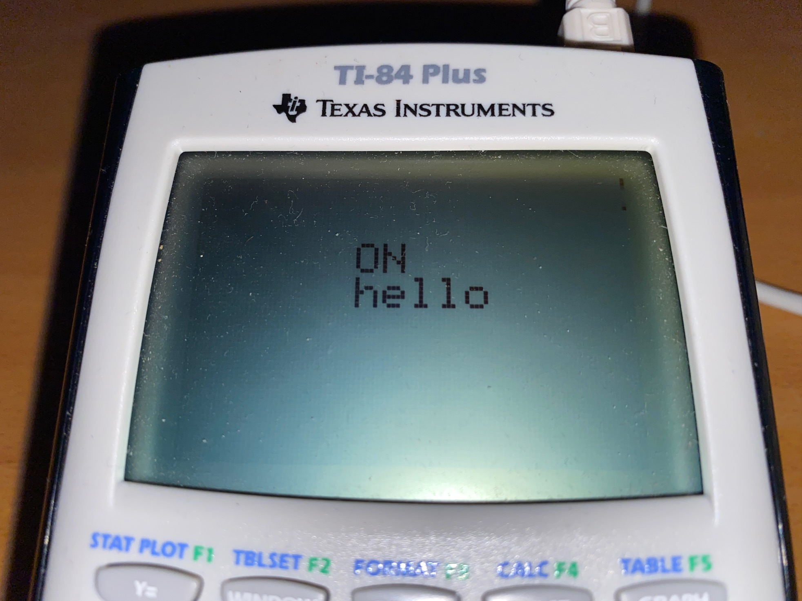

ti84-ref_app
==================

<p align="center">
    <a href="https://github.com/ckormanyos/ti84-ref_app/actions">
        </a>
    <a href="https://github.com/ckormanyos/ti84-ref_app/issues?q=is%3Aissue+is%3Aopen+sort%3Aupdated-desc">
        </a>
    <a href="https://github.com/ckormanyos/ti84-ref_app/blob/main/UNLICENSE">
        </a>
</p>

`ckormanyos/ti84-ref_app` creates a fully functioning reference application
for the z80-based TI-84 Plus monochrome graphics calculator. It runs in the
open `Asm(prgm)` interface provided in the calculator's `CATALOG` menu.
It uses the TI-84's on-board Z80 processor.

The reference application implements parallel _blinky_ and _hello_-_world_ test-shows.
A minimalistic cooperative multitasking scheduler controls
the presentation of the associated ASCII-text messages.

The text-shows _ON_/_OFF_ and _hello_/_world_ are written on the calculator screen.
Text is used since there is no actual LED present on the calculator-target system.
This is intended to simulate an LED-blinky by _toggling_ between _ON_ and _OFF_
and support an independent _hello_-_world_-task as well.
The _ON_/_OFF_ messages are printed every $1s$ and the _hello_/_world_ messages every $3s$.

The cooperative multitasking timebase is derived from a $1s$ tick.
The underlying 32-bit timer resides on ports `0x45`-`0x48`,
where the lower byte at port `0x45` is used.
This timer is only available on the TI-84, not the TI-83.

The blinky _ON_/_OFF_ and _hello_/_world_ text messages are printed
at rows $2$ and $3$, respectively, and both at column $6$.

A skinny `main()` subroutine in the soruce file
[`app_main.c`](./src/app/app_main.c) controls the program flow.
The application is written in high-level C17.
There is minimal use of assembly for startup and to interface with
[TI-83 Plus System Routines](https://education.ti.com/html/eguides/discontinued/computer-software/EN/SDK-TI-83-System-Routines_EN.pdf).

## Running on the Calculator

Execution:
  - After build, locate `bin/refapp.8xp`.
  - Drag `refapp.8xp` onto the calculator using the standard method with [TI Connect version 4](https://education.ti.com/en/software/details/en/B59F6C83468C4574ABFEE93D2BC3F807/swticonnectsoftware). Important: use version 4 for the TI-84 Plus.
  - The on-calculator name of the program is `REFAPP`.
  - To start the program, use the usual `Asm(prgm)` option found in the `CATALOG` menu and select the `REFAPP` program.
  - To exit the blinky _ON_/_OFF_ show, press the enter key.

The running programm in the display-state _ON_/_hello_ is shown in the image below.



## Tools and Build

This application uses the free
[`sdcc`](https://sdcc.sourceforge.net) toolchain.
C-runtime initialization (i.e., static initialization prior to the call of `main()`)
is supported with the file [crt0.s](./src/startup/crt0.s) in the `startup` directory.

The build system:
  - The build system uses GNUmake with a straighforward [Makefile](./build/Makefile).
  - The build system is supported on both `Win*` and `*nix`. Ported `*nix` tools support the `Win*`-build.
  - Build results including HEX-File and the on-calculator image `refapp.8xp` will be placed in the `bin`-directory.

### Build on `Win*`

Prerequisites:
  - Install [`sdcc`](https://sdcc.sourceforge.net) version 4.3 or higher.
  - Install python.

Then build in the command shell with:

```cmd
cd ti84-ref_app\build
make TYP_OS=WIN all
```

### Build on `*nix`

Prerequisites:
  - Install [`sdcc`](https://sdcc.sourceforge.net) version 4.3 or higher.

Then build in the bash shell with:

```sh
cd ti84-ref_app/build
make TYP_OS=UNIX all
```

## Testing and Continuous Integration

Testing has been performed on the target system, which is a fully-functioning
TI-84 Plus calculator purchased years ago from a commercial retailer.

Continuous integration is performed on GHA using an ubuntu-latest runner.
The [workflow run](./.github/workflows/ti84-ref_app.yml)
builds the application and verifies the presence of `bin/refapp.8xp`.

## Aditional Information

### Reservations Regarding Origins

Please use at your own discretion and observe also
the [license](./LICENSE) details.

Some of this software has been reverse engineered
from other projects or terse technical notes.
In addition, the software actively writes to calculator
_ports_, such as port `0x40` and port `0x41`.

Personally. I do not consider this to be a $100\\%$ sound basis
for project reliability and/or stability.

Nonetheless, empirical evidence shows a working,
and fully/properly initialized C-language, non-trivial application.
It provides a basis that seems to adhere to the established,
common rules of modern C. Larger projects could be built or modelled
from this.

Origins
  - This project has been inspired by and influenced by numerous previous works, including (but not limited to) the [azertyfun/LibTI](https://github.com/azertyfun/LibTI) project.

Licensing
  - The source code written for this repo (in the [`src`](./src)) directory is licensed under [_The_ _Unlicense_](./LICENSE).
  - `Win*` ported `*nix` tools (including `cp.exe`, `echo.exe`, `mkdir.exe`, `mv.exe` and `rm.exe`) originate from [UnxTools](https://sourceforge.net/projects/unxutils) and include their own [distribution statements](./build/tools/UnxUtils).
  - The `Win*`-ported `objcopy.exe` originates from _nuwen_'s specially-built [standalone MinGW](https://nuwen.net/mingw.html).
  - The `Win*`-ported GNUmake is taken from [`ckormanyos/make-4.2.1-msvc-build`](https://github.com/ckormanyos/make-4.2.1-msvc-build).
